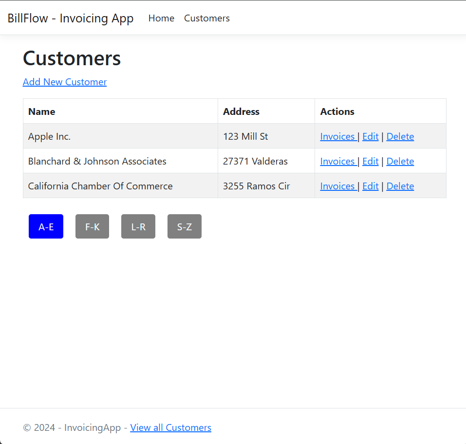
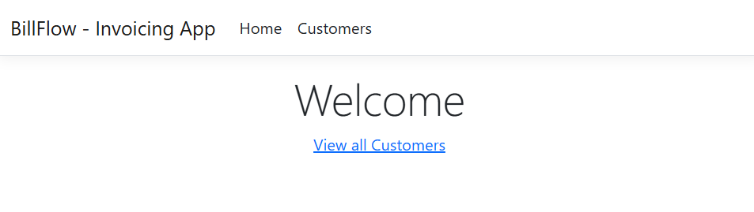
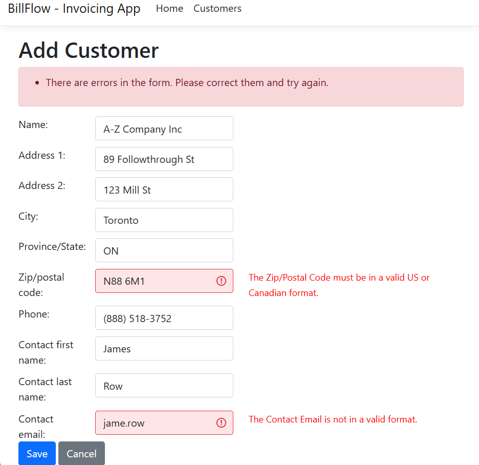
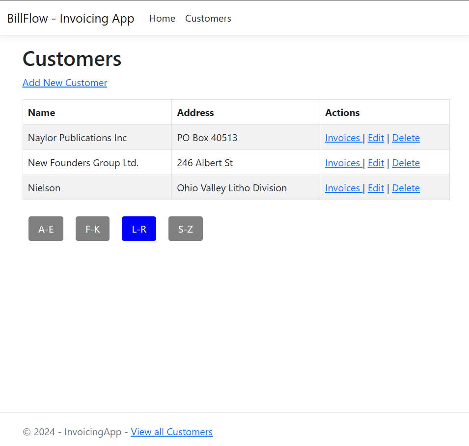
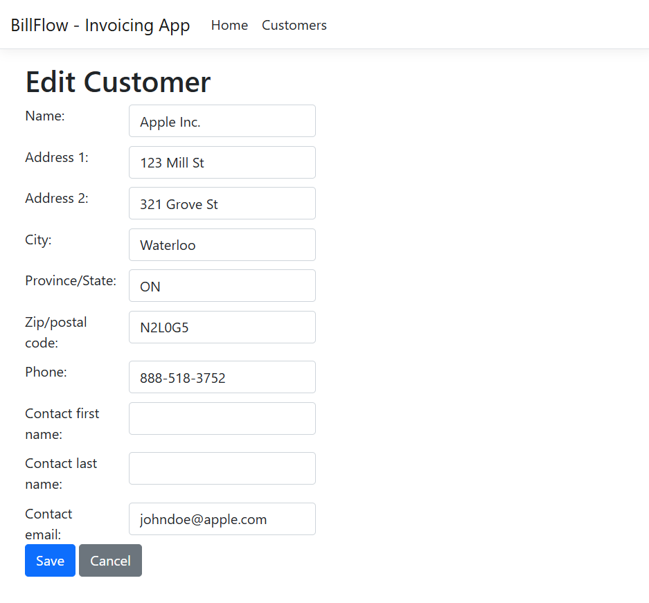
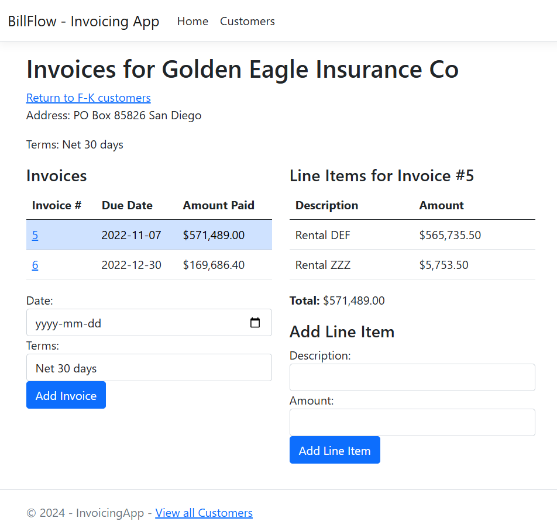
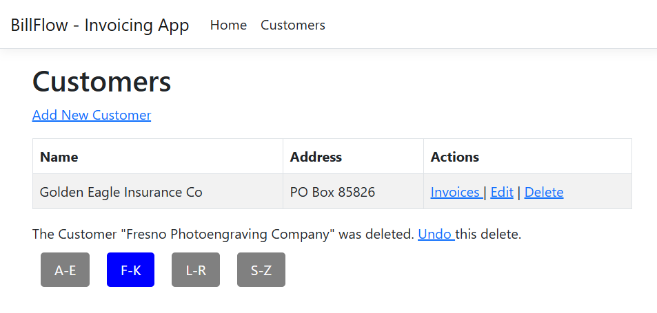

# BillFlow Invoicing App

BillFlow Invoicing App is a web-based ASP.NET MVC application designed to manage customers and their invoices efficiently. With features like customer segmentation, validation, and line-item management, it simplifies invoicing workflows. This project also showcases CRUD operations, Entity Framework Core, and unit testing. 



## Table of Contents

1. [Features](#features)
2. [Requirements](#requirements)
3. [Installation](#installation)
4. [Usage](#usage)
5. [Screenshots](#screenshots)
6. [Contributing](#contributing)
7. [License](#license)

## Features

- View, add, edit, and delete customers with intuitive UI.
- Alphabetical filtering for customer segmentation.
- Invoice management with detailed line items.
- Validation for customer data (e.g., postal codes, email addresses).
- Undo functionality for deleted records.

## Requirements

- Windows, MacOS, or Linux OS
- .NET Core SDK 6.0 or newer
- Visual Studio 2022 or Visual Studio Code (recommended)

## Installation

1. Clone the repository:

   ```bash
   git clone https://github.com/liamc-code/BillFlow_Invoicing_App.git
   ```

2. Navigate to the project directory:

   ```bash
   cd BillFlow_Invoicing_App
   ```

3. Navigate to /InvoicingApp/appsettings.json and confirm you have the right database setup

4. Build the application:

   ```bash
   dotnet build
   ```

5. Run the application:

   ```bash
   dotnet run
   ```

6. Open your browser and navigate to `http://localhost:5000` to access the application.

## Usage

1. **View Customers**:
   - Use the Customers page to view all customers, segmented alphabetically.

2. **Add a Customer**:
   - Navigate to "Add New Customer" to create a customer record.
   - Ensure all fields meet validation criteria.

3. **Edit Customer Information**:
   - Click "Edit" on a customer's record to update details.

4. **Manage Invoices**:
   - View a customer's invoices, add new invoices, and manage line items.

5. **Undo Deleted Records**:
   - Restore a deleted customer record using the "Undo" option.

## Screenshots

### Home Entry Point


### Customers A-E Page


### Add Customer with Validation Errors


### Customers L-R Page


### Edit Customer Example


### Invoices for Customer Example


### Undo Deleted Record


## License

BillFlow Invoicing App is released under the [MIT License](./LICENSE).

